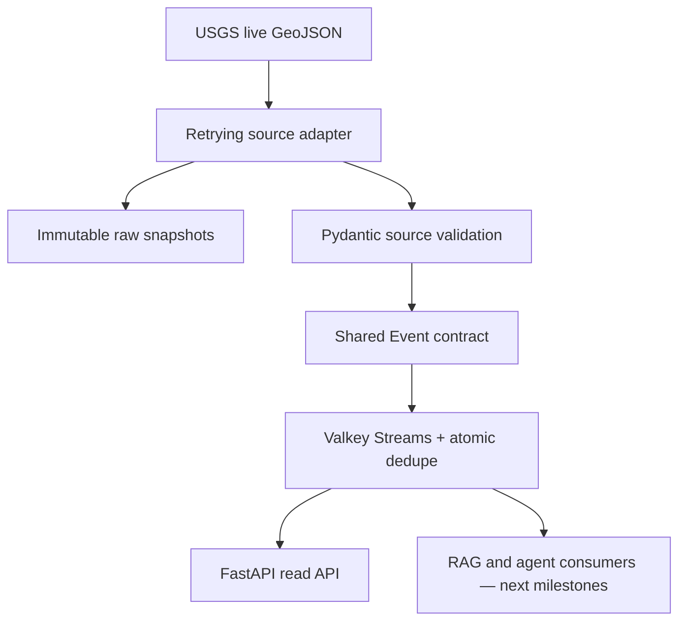

# AtlasPulse

[](https://github.com/Thivas12/atlas-pulse/actions/workflows/ci.yml)

Real-time, evidence-grounded global disruption intelligence built from authoritative public
data. AtlasPulse is designed as a production system, not a notebook: source bytes remain
auditable, contracts are strict, delivery is replayable, failures are observable, and every
component can run without a paid API key.

> **Current milestone — live seismic vertical slice.** The worker polls the official USGS
> all-earthquakes feed every 60 seconds, preserves the unmodified response, validates and
> normalizes it, and atomically publishes new events to Valkey Streams. The API exposes
> health, dependency readiness, and the newest normalized events.

## Why this is portfolio-grade

| Capability | Concrete proof in this repository |
| --- | --- |
| Real public data | Live USGS GeoJSON feed, updated every minute |
| Auditability | SHA-256 content-addressed raw snapshots are written before parsing |
| Reliable delivery | Bounded HTTP retry plus revision-aware atomic Lua deduplication |
| Shared contracts | Immutable `Event` and `GeoPoint` models pinned to `agent-rag-core` commit `7732801` |
| Replay | Every normalized event receives a stable Valkey Stream ID |
| Operations | Liveness, dependency readiness, JSON logs, OpenTelemetry traces, graceful shutdown |
| Engineering quality | Strict mypy, Ruff, locked dependencies, 28 unit/contract tests and a real-Valkey CI test |
| Supply-chain hygiene | Read-only workflow permissions, commit-pinned Actions, weekly dependency updates |

## Architecture



The source is at-least-once. Identical semantic content is idempotent for the configured
seven-day dedupe window, while a USGS correction remains a new immutable revision. AtlasPulse
deliberately does not claim impossible end-to-end "exactly once" semantics.

## Run the full slice

Prerequisites: Docker Engine with Compose v2. Docker Desktop is fine for personal or
educational use; Podman is a fully open-source alternative.

```bash
git clone https://github.com/Thivas12/atlas-pulse.git
cd atlas-pulse
docker compose up --build
```

After the ingestor completes its first cycle:

```bash
curl -s http://localhost:8000/healthz
curl -s http://localhost:8000/readyz
curl -s 'http://localhost:8000/v1/events?limit=5'
```

Interactive OpenAPI documentation is at <http://localhost:8000/docs>. Stop the stack with
`docker compose down`. Add `--volumes` only when you intentionally want to delete local
stream data and raw snapshots.

## Develop without rebuilding containers

[uv](https://docs.astral.sh/uv/) manages Python and installs the exact lockfile. Keep only
Valkey in Docker and run both Python processes in WSL:

```bash
cp .env.example .env
docker compose up -d valkey
uv sync --frozen --all-groups
ATLAS_VALKEY_URL=valkey://localhost:6379/0 uv run atlas-pulse-ingest
```

In a second terminal:

```bash
ATLAS_VALKEY_URL=valkey://localhost:6379/0 \
  uv run uvicorn atlas_pulse.asgi:app --reload --port 8000
```

Run the same quality gate as CI:

```bash
uv run ruff format --check .
uv run ruff check .
uv run mypy src tests
uv run pytest --cov=atlas_pulse --cov-branch --cov-report=term-missing
```

The integration test activates automatically when `ATLAS_TEST_VALKEY_URL` is present:

```bash
ATLAS_TEST_VALKEY_URL=valkey://localhost:6379/0 uv run pytest -m integration
```

## API

| Method | Path | Purpose |
| --- | --- | --- |
| `GET` | `/healthz` | Process liveness; does not depend on Valkey |
| `GET` | `/readyz` | Returns `503` when Valkey is unavailable |
| `GET` | `/v1/events?limit=50` | Newest normalized events and their replay IDs |

Every event contains a stable source ID, an aware occurrence time, ingestion time, semantic
type, WGS84 location, source name, schema version, and JSON-safe payload. USGS depth is kept
as positive-down `payload.depth_km`; the shared geographic altitude is its negative value.

## Failure behavior

- HTTP transport errors, `429`, and `5xx` responses retry with bounded exponential backoff.
- Permanent `4xx` responses fail immediately.
- Valid HTTP bodies are snapshotted before schema parsing, so upstream schema drift remains
  inspectable.
- A canonical content fingerprint ignores poll time but preserves source revisions; a Lua
  transaction makes its lookup, stream append, and registration atomic.
- `MAXLEN ~ 100000` bounds local stream growth; original snapshots remain independently
  retained.
- Readiness fails closed when the stream is unavailable; liveness remains available.

See [ADR 0001](docs/adr/0001-use-valkey-streams.md) for the event-bus decision and
[ADR 0002](docs/adr/0002-snapshot-before-validation.md) for the evidence boundary.

## Free stack

No part of this milestone needs a paid model, paid dataset, or API key.

| Layer | Tool/data | Cost for this project |
| --- | --- | --- |
| Live source | [USGS Earthquake GeoJSON feeds](https://earthquake.usgs.gov/earthquakes/feed/v1.0/geojson.php) | Public, no key |
| API/contracts | Python, FastAPI, Pydantic | Open source |
| Event stream | Valkey + `valkey-py` | Open source |
| Observability | OpenTelemetry | Open source; console export by default |
| Toolchain | uv, Ruff, mypy, pytest | Open source |
| Runtime | Docker Engine/Compose or Podman | Free/open-source options |
| CI | GitHub Actions on this public repository | Free hosted runners for public repos |

## Next milestones

1. Deterministic historical replay and a MapLibre live earthquake map.
2. NWS alerts, NASA FIRMS wildfire data, and GDELT news signals with a common provenance
   envelope.
3. Hybrid sparse/dense/geospatial retrieval, reranking, temporal filtering, and citation
   verification.
4. A hierarchy of specialist agents for signal fusion, contradiction detection, impact
   assessment, forecasting, and human approval.
5. Evaluation datasets, RAGAS-style retrieval metrics, agent trajectory scoring, drift
   monitoring, and a fully free deployment path.

## Data and attribution

Earthquake data comes from the
[U.S. Geological Survey](https://earthquake.usgs.gov/earthquakes/feed/v1.0/geojson.php).
Read the USGS feed documentation and policies before operating a public mirror. Frozen test
fixtures are synthetic source-shaped records, not claims about real events.

Licensed under the [MIT License](LICENSE).
