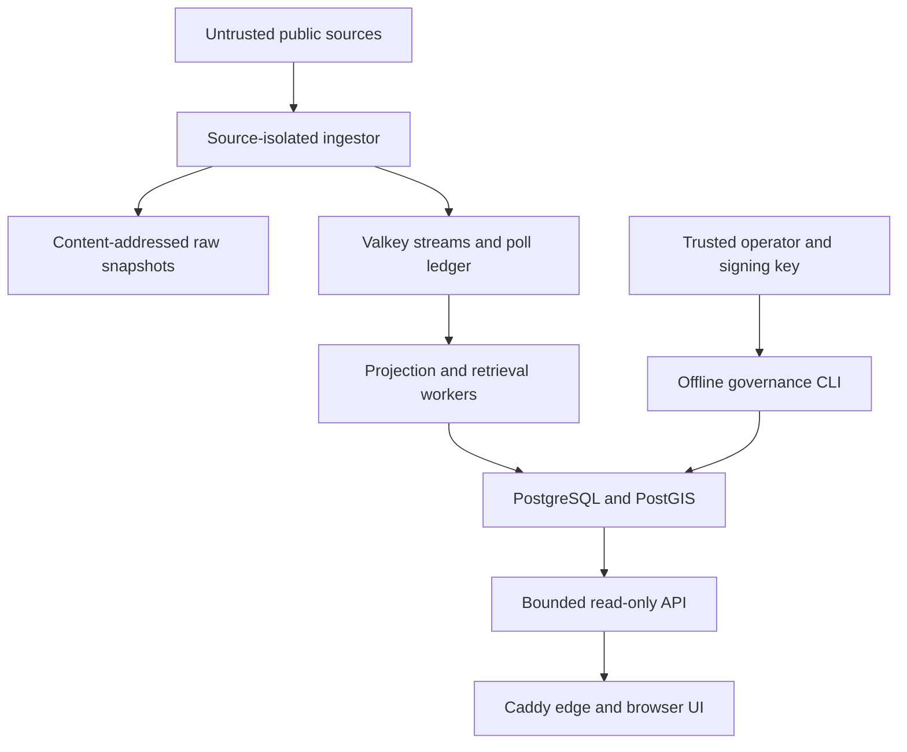

# AtlasPulse threat model

Status: current for the v0.12 architecture. Review this document whenever a trust boundary,
public endpoint, credential, storage backend, deployment topology, or agent authorization rule
changes.

## Scope and security goals

This model covers the checked-in ingestion, storage, projection, retrieval, public API and browser
surface, offline evaluation tools, default-deny agent governance path, container deployment, and
GitHub Actions workflows.

The primary security goals are:

1. preserve the integrity and provenance of public-source evidence;
2. prevent one malformed or unavailable source from corrupting or stopping unrelated sources;
3. keep the FIRMS key, signing private keys, and operational credentials out of events, public
   APIs, telemetry, artifacts, and source control;
4. keep generated-answer and agent execution capabilities unavailable unless a future, separately
   reviewed release boundary is implemented; and
5. make changes and operational claims independently inspectable without overstating guarantees.

AtlasPulse is not a multi-tenant system, a confidential intelligence store, an emergency-alerting
service, or a high-availability service. Its public-source records can be wrong, delayed,
duplicated, or adversarial. The current agent execution path is intentionally absent.

## Trust boundaries and data flow

| Boundary | Data crossing it | Existing controls | Important residual risk |
| --- | --- | --- | --- |
| Public internet → ingestor | USGS, NWS, FIRMS, and GDELT responses | Fixed operator-configured endpoints, HTTPS, timeouts, bounded retries, strict schemas, per-source failure isolation, raw snapshot before parsing | A legitimate provider or its distribution path can publish misleading but schema-valid data |
| Ingestor → local state | Raw bytes, normalized events, poll transitions | SHA-256 snapshot identity, bounded payload/row/event limits, atomic stream publication, credential-free poll history | A host or volume administrator can alter or delete retained evidence; storage is not WORM |
| Valkey → workers → PostgreSQL | At-least-once event revisions and checkpoints | Idempotent identities, immutable revisions, newer-only current pointers, checkpoint/projection transactions, and exact per-client internal networks | Compromise of Valkey, PostgreSQL, a permitted client, or the shared application database role can still cross its authorized boundary |
| PostgreSQL/Valkey → API | Public events, graph, search, freshness, evidence packs, blocked run manifests | Read-only HTTP surface, typed response contracts, strict query limits and cursors, no arbitrary server-side URL fetch | There is no user authentication, per-client quota, or application-layer rate limit |
| API → browser/user | Public-source text, coordinates, links, operational state | React text escaping, Zod validation, credential-safe citation rules, HTTPS edge, and synchronized browser security headers | Source text can still be deceptive; external evidence links, map tiles, and web fonts leave the site boundary |
| Operator → governance ledger | Proposal approvals, revocations, public keys | Exact proposal scope, Ed25519 signatures, trusted key IDs, expiry, append-only hash chain, PostgreSQL constraints | Private-key or operator-host compromise defeats the human-authenticity assumption |
| Pull request → GitHub Actions | Repository code and dependency changes | `pull_request` rather than `pull_request_target`, read-only default token, commit-pinned actions, digest-pinned container inputs, no retained checkout credentials, CodeQL, locked dependency audits, and runtime image scanning | GitHub-hosted runners, pinned third-party action commits, image registries, and vulnerability databases remain trusted dependencies |

## Threat register

| ID | Threat and impact | Current mitigation | Residual risk / next control |
| --- | --- | --- | --- |
| T1 | Malicious, compromised, or malformed upstream data causes false records or parser failure | Preserve source bytes before validation; enforce strict source-specific schemas and semantic bounds; isolate source failures | Schema-valid misinformation remains possible. UI and reports must retain source attribution and uncertainty language |
| T2 | Oversized downloads, decompression bombs, or expensive queries exhaust a small host | HTTP timeouts/retry caps; GDELT compressed, uncompressed, row, and event caps; bounded API limits; container CPU/memory limits | The public edge has no rate limiter or WAF. Add measured rate limits before advertising availability guarantees |
| T3 | FIRMS or operational credentials leak through URLs, exceptions, telemetry, artifacts, or containers | FIRMS key is ingestor-only; settings use a secret type; URL telemetry is redacted/excluded; events and poll history omit URLs and exceptions; secrets/artifacts are ignored | Root access, container inspection, or unsafe operator logging can expose environment values. Rotate on suspected disclosure |
| T4 | Replay, duplication, or partial writes corrupt current state | Content and provider identities, at-least-once semantics, atomic Valkey publication, idempotent database constraints, transactional checkpoints | A database administrator can rewrite state. Content addresses detect many changes but do not provide external notarization |
| T5 | A crafted query or public request triggers injection, SSRF, data exfiltration, or unbounded work | SQLAlchemy-bound values, typed query contracts, hard result caps, fixed upstream endpoints, no API-controlled fetch target | Treat new URL-accepting or write endpoints as new trust boundaries requiring dedicated abuse tests |
| T6 | Unsafe evidence URLs expose credentials or direct users to private/local targets | Citation validation rejects embedded credentials and private/local targets; evidence packs never fetch citations server-side | A structurally public URL is not a safe or truthful destination. The UI must not describe `traceable` as verified |
| T7 | Prompt injection in public-source text controls a model or tool | Evidence text is explicitly untrusted; production search creates no answer; model runners are offline, bounded, and promotion-blocked; agent execution is hard-disabled | Any future tool-using model requires a new authenticated canary boundary, capability allowlist, kill switch, and rollback plan |
| T8 | Forged, replayed, stale, or over-broad approval bypasses agent governance | Exact proposal binding, actor identity, 24-hour maximum approval, revocation events, trusted Ed25519 keys, 11 default-deny checks | The ledger proves configured-key authorization, not the real-world identity or judgment of the key holder |
| T9 | Vulnerable or mutable dependencies compromise builds or runtime images | Locked Python/npm dependencies, commit-pinned GitHub Actions, tag-plus-digest container inputs, expanded Dependabot coverage, `uv audit`, `npm audit`, CodeQL, and Trivy reporting all serious runtime findings while rejecting fixable HIGH/CRITICAL operating-system packages | Registries, package repositories, scanner databases, and pinned third-party code remain trusted; scans detect only known vulnerabilities at one point in time, while unfixed findings and embedded vendor-binary remediations remain visible but non-blocking |
| T10 | A compromised internal service moves laterally through shared infrastructure | Public host ports bind to loopback; only the edge publishes ports; exact two-member internal networks isolate every client/data-service link and both proxy hops; ingestor and edge use distinct single-service egress networks; injected database, Valkey, FIRMS, and approval settings are scoped to required processes; the public overlay enforces a 32-character minimum URL-safe database password format | PostgreSQL and Valkey remain central trust points, four processes share one application database role, host/Docker administrators bypass container isolation, password randomness remains an operator responsibility, and the local-development profile intentionally retains a known password for loopback use |
| T11 | XSS or hostile source text compromises a browser session | React escapes rendered strings; client responses are schema-validated; both Caddy layers enforce the same restrictive CSP; the production-build browser smoke fails on policy violations | MapLibre requires blob workers and inline styles, while map tiles and web fonts remain allowlisted external origins. Revisit these exceptions before adding authenticated browser state |
| T12 | CI configuration gains excessive authority or runs attacker-controlled code with secrets | Workflow-level `contents: read`, narrowly scoped CodeQL upload permission, SHA-pinned actions, checkout credentials disabled, no `pull_request_target` | Repository rules must require the security checks and block force pushes; workflow files alone cannot enforce merge policy |

## Verification mapped to the model

| Control area | Evidence in the repository |
| --- | --- |
| Input and parser boundaries | Synthetic source fixtures, strict validation tests, retry/limit tests, and Hypothesis coverage |
| Durable and replayable state | Memory/Valkey stream tests, PostGIS projection integration tests, checkpoint and duplicate tests |
| Public contracts | API tests, browser schema tests, UI component tests, a deterministic Chromium smoke test of production assets under the enforced header policy, and container edge smoke tests |
| Credential handling | FIRMS redaction and scoping tests plus credential-free source-poll contracts |
| Model and agent containment | Gold-blind/offline runner tests, blocked promotion traces, signed-ledger tests, and default-deny preflight tests |
| Operational claims | Content-addressed probe/resource samples and read-only restart, backup, restore, and source-recovery drill bindings |
| Runtime isolation | A machine-readable Compose trust graph, semantic rendered-model validation, credential-owner checks, and a public database-password format gate |
| Change security | Static repository-policy tests, CodeQL for Python and JavaScript/TypeScript, locked Python/npm vulnerability audits, immutable container-input parity, complete serious runtime-image reporting, and a fixable HIGH/CRITICAL operating-system package gate |

Passing tests or scans reduce known risk; they do not prove that a deployment is secure, live,
complete, or available.

## Repository controls requiring owner configuration

The repository files cannot enforce branch policy by themselves. Configure a `main` ruleset that
requires pull requests, successful CI and security checks, resolved review conversations, and
blocks force pushes and branch deletion. Because the repository currently has one code owner, do
not require an independent CODEOWNER approval until a second trusted collaborator exists; an
author cannot provide independent review of their own change.

Enable private vulnerability reporting and secret scanning in repository settings when available.
Enable the dependency graph before adding GitHub's diff-scoped dependency-review action; until
then, the security workflow audits both complete lockfiles on every pull request, `main` push, and
weekly run. Weekly Docker updates cover every directory with an external image declaration; the
repository policy requires those declarations to stay synchronized with
`deploy/container-images.json`. Treat every alert as a lead to validate, not as proof of
exploitability.

## Review triggers

Revisit this model before adding a write API, user accounts, private data, arbitrary URL ingestion,
new secrets, a new public network service, a different persistence layer, browser authentication,
hosted model inference, agent network/tool access, or any executable side effect.
